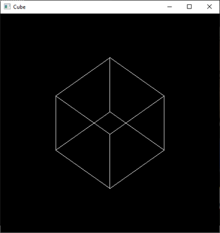
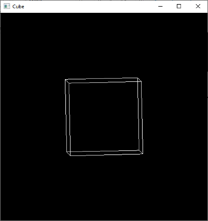

# UNIR - Fundación Universitaria Internacional de la Rioja en Colombia
### Curse: Informática Gráfica y Visualización (COLGII) - Enero2022 2Q
### Profesor: Rogerio Orlando Beltrán Castro
### Code reference: https://youtu.be/eHw6zKUw3uU

## Tools
- Python 3.10.4
- Pycharm Professional 22.1
- PyOpenGL 3.1.6-cp310-win_amd
- PyOpenGL-Accelerate 3.1.6-cp310-win_amd

## Descripcion
Cube create with PyopenGL using GlutWireCube function for draw the cube.

When you click to the windows in a random position, the cube change his rotation.

